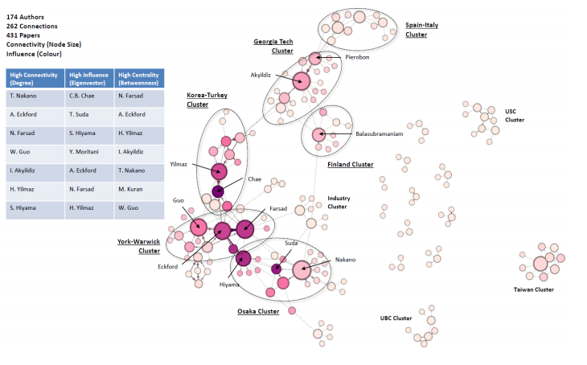

# BOUN CMPE492 Project

Members:
- Mehmet Umut Öksüz
- Mehdi Saffar
- Adil Numan Çelik

Advisors:
- Suzan Üsküdarlı
- H. Birkan Yılmaz
## Social Network Analysis of Researchers (SONAR)

**Abstract:** Analyzing the relation between researchers in a domain is possible via representing the authors of papers in that domain
by a directed graph (DG). Thus, we can find/visualize the highly influential researchers in a domain. 

Please find more details on the project in the [project description](project_description.pdf)

[Repository of the backend](https://github.com/adilnumancelik/cmpe492-sonar-backend)

[Repository of the frontend](https://github.com/MehdiSaffar/cmpe492-sonar-frontend)
